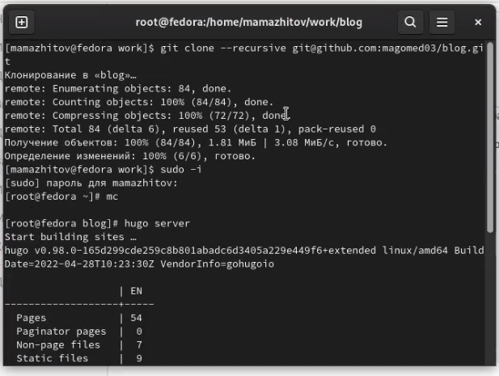
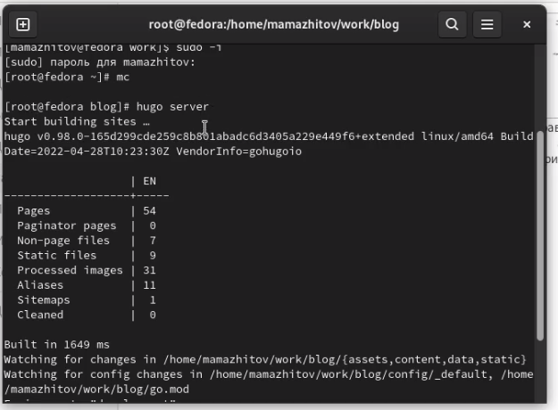
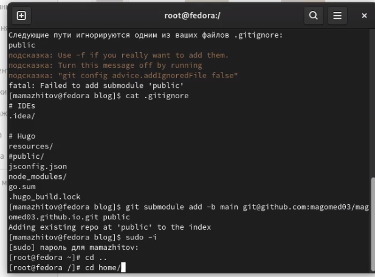
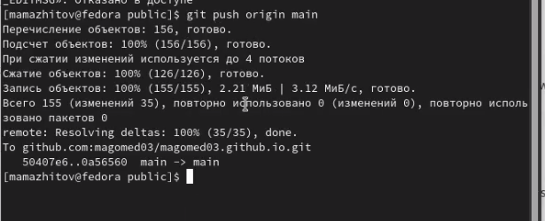

---
## Front matter
lang: ru-RU
title: 1 этап реализации проекта
author: Мажитов М.А.
institute: RUDN University, Moscow, Russian Federation
date:

## Formatting
toc: false
slide_level: 2
theme: metropolis
header-includes: 
 - \metroset{progressbar=frametitle,sectionpage=progressbar,numbering=fraction}
 - '\makeatletter'
 - '\beamer@ignorenonframefalse'
 - '\makeatother'
aspectratio: 43
section-titles: true
---

## Цель работы

Разместить на Github pages заготовки для персонального сайта.

---

## Ход работы

**1.** Скачал Hugo с репозитория и копировал его в **/usr/lockal/bin**. На скриншоте файлы отмечены удаленными, так как я их разархивировал и удалил сам архив.
(рис. [-@fig:001])

{ #fig:001 width=70% }

---

## Ход работы

**2.** Создал репозиторий на основе шаблона, представленного на ТУИС-е.(рис. [-@fig:002])

{ #fig:002 width=70% }

---

## Ход работы

**3.** Создал локальный клон репозитория.(рис. [-@fig:003])

{ #fig:003 width=70% }

---

## Ход работы

**4.** Создал локальный сайт.(рис. [-@fig:004])

{ #fig:004 width=70% }

---

## Ход работы
**5.** Удалил файл **demo.md**, чтобы убрать зеленое предупреждение.(рис. [-@fig:005])

{ #fig:005 width=70% }

---

## Ход работы

**6.** Далее я создал репозиторий **magomed03.github.io**.(рис. [-@fig:006])

{ #fig:006 width=70% }

---

## Ход работы

**7.** Также создал его локальный клон, создал ветку **main**, файл **README.md** в этой ветке и запушил их.(рис. [-@fig:007])

{ #fig:007 width=70% }

---

## Ход работы

**8.** Подключил последний репозиторий к папке **public** в репозитории **blog**.(рис. [-@fig:008])

{ #fig:008 width=70% }

---

## Ход работы

**9.** Снова запускаем команду **hugo** в каталоге **blog**.(рис. [-@fig:009])

{ #fig:009 width=70% }

---

## Ход работы

**10.** Запушил все изменения на Github. (рис. [-@fig:010])

{ #fig:010 width=70% }

---

## Вывод

Мы научились создавать сайт с помощью **Hugo** на основе шаблона.