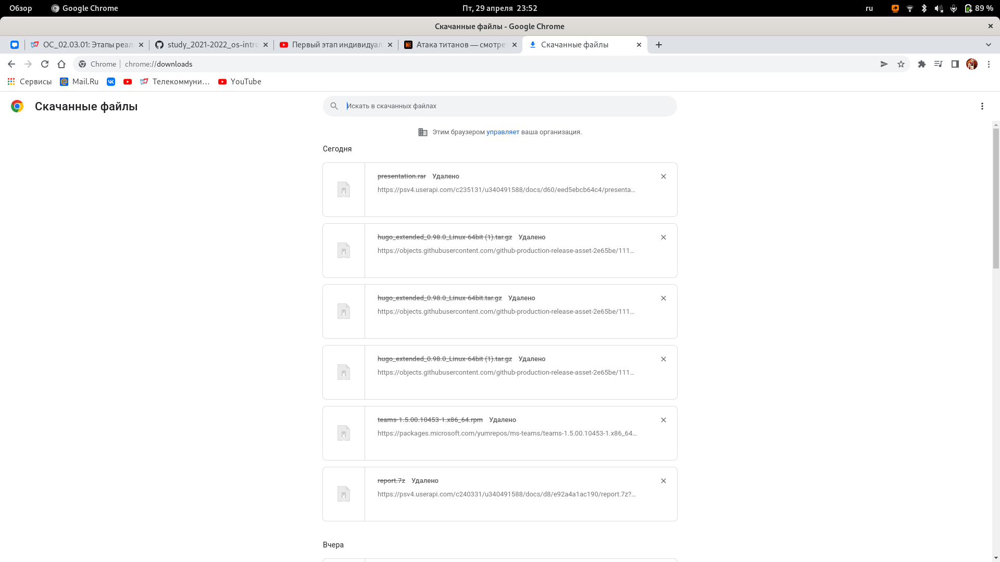
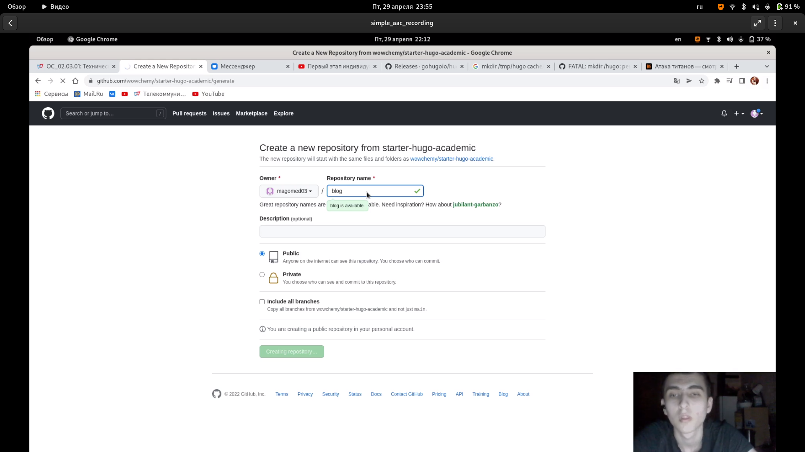
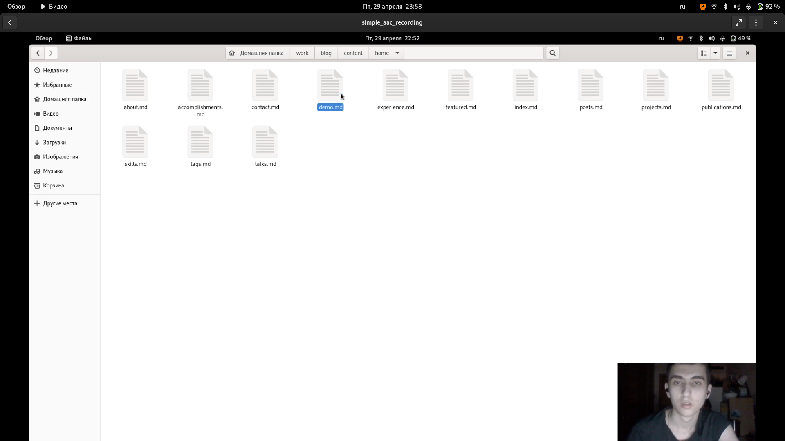
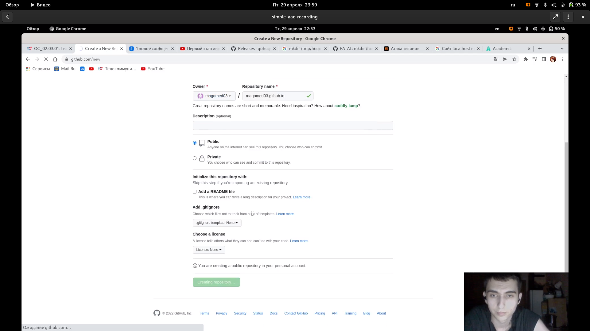
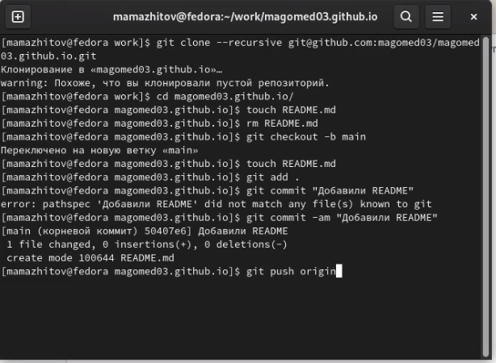
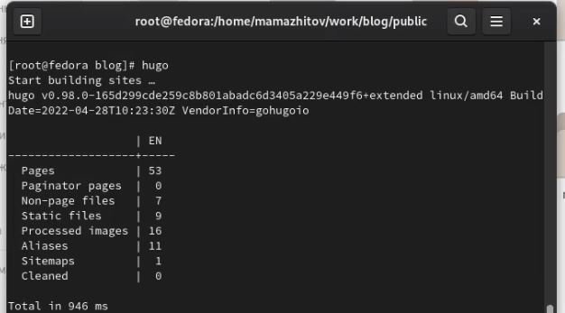

---
## Front matter
title: "1 этап реализации проекта"
subtitle: "Размещение на Github pages заготовки для персонального сайта"
author: "Магомед Асхабович Мажитов"

## Generic otions
lang: ru-RU
toc-title: "Содержание"

## Bibliography
bibliography: bib/cite.bib
csl: pandoc/csl/gost-r-7-0-5-2008-numeric.csl

## Pdf output format
toc: true # Table of contents
toc-depth: 2
lof: true # List of figures
lot: true # List of tables
fontsize: 12pt
linestretch: 1.5
papersize: a4
documentclass: scrreprt
## I18n polyglossia
polyglossia-lang:
  name: russian
  options:
	- spelling=modern
	- babelshorthands=true
polyglossia-otherlangs:
  name: english
## I18n babel
babel-lang: russian
babel-otherlangs: english
## Fonts
mainfont: PT Serif
romanfont: PT Serif
sansfont: PT Sans
monofont: PT Mono
mainfontoptions: Ligatures=TeX
romanfontoptions: Ligatures=TeX
sansfontoptions: Ligatures=TeX,Scale=MatchLowercase
monofontoptions: Scale=MatchLowercase,Scale=0.9
## Biblatex
biblatex: true
biblio-style: "gost-numeric"
biblatexoptions:
  - parentracker=true
  - backend=biber
  - hyperref=auto
  - language=auto
  - autolang=other*
  - citestyle=gost-numeric
## Pandoc-crossref LaTeX customization
figureTitle: "Рис."
tableTitle: "Таблица"
listingTitle: "Листинг"
lofTitle: "Список иллюстраций"
lotTitle: "Список таблиц"
lolTitle: "Листинги"
## Misc options
indent: true
header-includes:
  - \usepackage{indentfirst}
  - \usepackage{float} # keep figures where there are in the text
  - \floatplacement{figure}{H} # keep figures where there are in the text
---

# Цель работы

Разместить на Github pages заготовки для персонального сайта.

# Задание

- Установить необходимое программное обеспечение.
- Скачать шаблон темы сайта.
- Разместить его на хостинге git.
- Установить параметр для URLs сайта.
- Разместить заготовку сайта на Github pages.

# Выполнение лабораторной работы
**1.** Скачал Hugo с репозитория и копировал его в **/usr/lockal/bin**. На скриншоте файлы отмечены удаленными, так как я их разархивировал и удалил сам архив.
(рис. [-@fig:001])

{ #fig:001 width=70% }

**2.** Создал репозиторий на основе шаблона, представленного на ТУИС-е.(рис. [-@fig:002])

{ #fig:002 width=70% }

**3.** Создал локальный клон репозитория.(рис. [-@fig:003])

{ #fig:003 width=70% }

**4.** Создал локальный сайт.(рис. [-@fig:004])

{ #fig:004 width=70% }

**5.** Удалил файл **demo.md**, чтобы убрать зеленое предупреждение.(рис. [-@fig:005])

{ #fig:005 width=70% }

**6.** Далее я создал репозиторий **magomed03.github.io**.(рис. [-@fig:006])

{ #fig:006 width=70% }

**7.** Также создал его локальный клон, создал ветку **main**, файл **README.md** в этой ветке и запушил их.(рис. [-@fig:007])

{ #fig:007 width=70% }

**8.** Подключил последний репозиторий к папке **public** в репозитории **blog**.(рис. [-@fig:008])

{ #fig:008 width=70% }

**9.** Снова запускаем команду **hugo** в каталоге **blog**.(рис. [-@fig:009])

{ #fig:009 width=70% }

**10.** Запушил все изменения на Github. (рис. [-@fig:010])

{ #fig:010 width=70% }
# Выводы

Мы создали свой сайт с помощью **hugo** на основе шаблона
