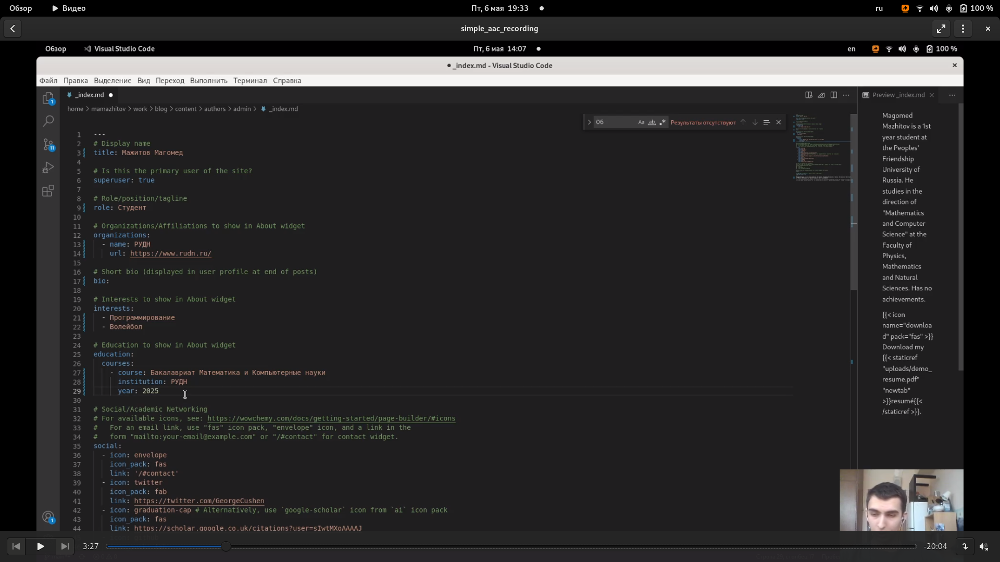
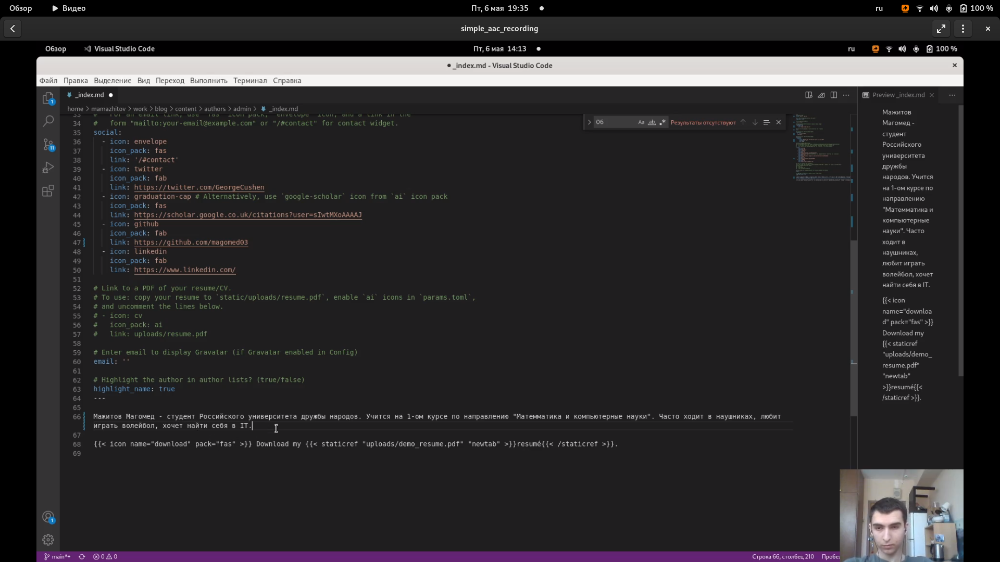
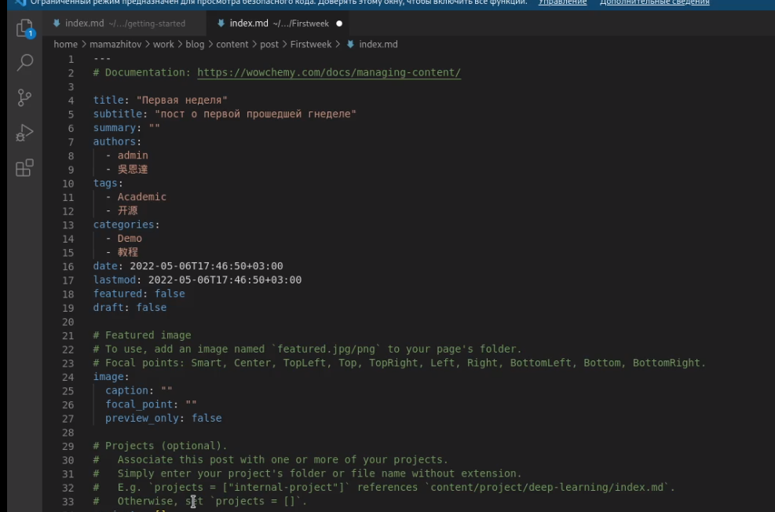
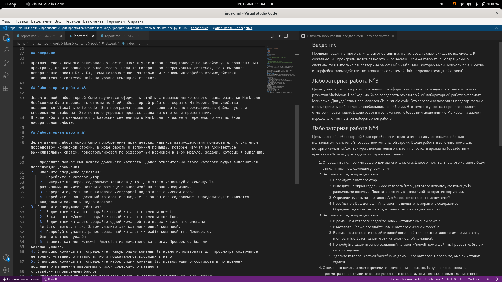
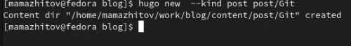
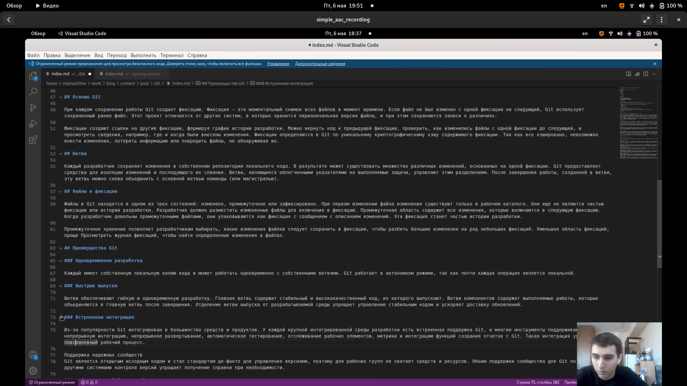
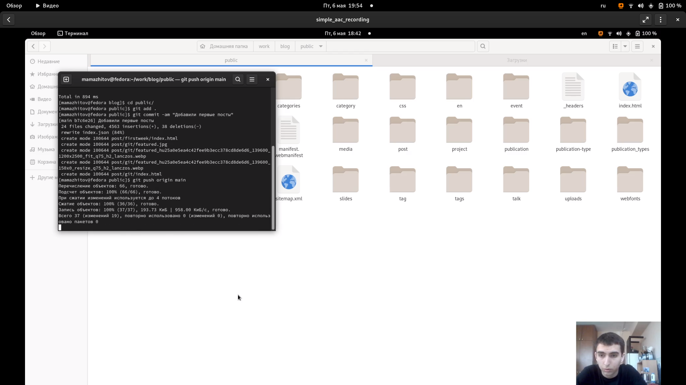

---
## Front matter
lang: ru-RU
title: 2 этап реализации проекта
author: Мажитов М.А.
institute: RUDN University, Moscow, Russian Federation
date:

## Formatting
toc: false
slide_level: 2
theme: metropolis
header-includes: 
 - \metroset{progressbar=frametitle,sectionpage=progressbar,numbering=fraction}
 - '\makeatletter'
 - '\beamer@ignorenonframefalse'
 - '\makeatother'
aspectratio: 43
section-titles: true
---

## Цель работы

Добавить на сайт данные о себе. Разместить первые посты.

---

## Задачи

- Список добавляемых данных.
  - Разместить фотографию владельца сайта.
  - Разместить краткое описание владельца сайта (Biography).
  - Добавить информацию об интересах (Interests).
  - Добавить информацию от образовании (Education).
- Сделать пост по прошедшей неделе.

---

- Добавить пост на тему по выбору:
  - Управление версиями. Git.
  - Непрерывная интеграция и непрерывное развертывание (CI/CD).

---

## Ход работы

**1.** Перешел в каталог /blog/content/authors/admin и открыл файл *index*. Его мы и будем редактировать для того чтобы выполнить первое задание.
(рис. [-@fig:001])

{ #fig:001 width=70% }

---

## Ход работы

**2.** Изменил заглавие, интересы, роль, образование и ссылку на гитхаб.(рис. [-@fig:002])

{ #fig:002 width=70% }

---

## Ход работы

**3.** Разместил краткую информацию о себе.(рис. [-@fig:003])

{ #fig:003 width=70% }

---

## Ход работы

**4.** Нашел фотографию олицетворяющую мое психологическое состояние, скачал ее и переместил в текущую директорию.(рис. [-@fig:004])

{ #fig:004 width=70% }

---

## Ход работы

**5.** Создал новый пост о прошедшей неделе.(рис. [-@fig:005])

{ #fig:005 width=70% }

---

## Ход работы

**6.** Заполинл титульник.(рис. [-@fig:006])

{ #fig:006 width=70% }

---

## Ход работы

**7.** Расписал в посте, как прошла неделя и что я сделал за это время.(рис. [-@fig:007])

{ #fig:007 width=70% }

---

## Ход работы

**8.** Создал новый пост на тему *Git*.(рис. [-@fig:008])

{ #fig:008 width=70% }

---

## Ход работы

**9.** Скопировал все с сайта *Microsoft* и отредактировал текст.(рис. [-@fig:009])

{ #fig:009 width=70% }

---

## Ход работы

**10.** Запустил *hugo*. (рис. [-@fig:010])

{ #fig:010 width=70% }

---

## Ход работы

**11.** Запушил все изменения на Github. (рис. [-@fig:011])

{ #fig:011 width=70% }

---

## Вывод

Мы добавили информацию о себе и создали первые посты.