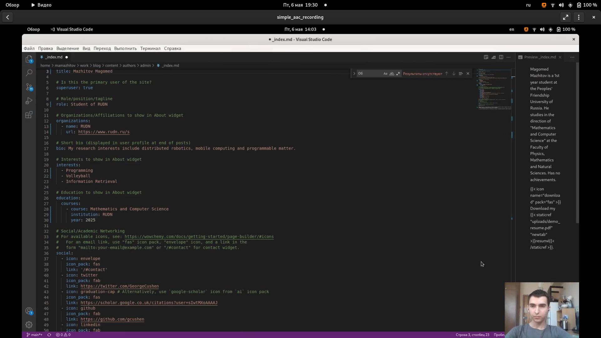
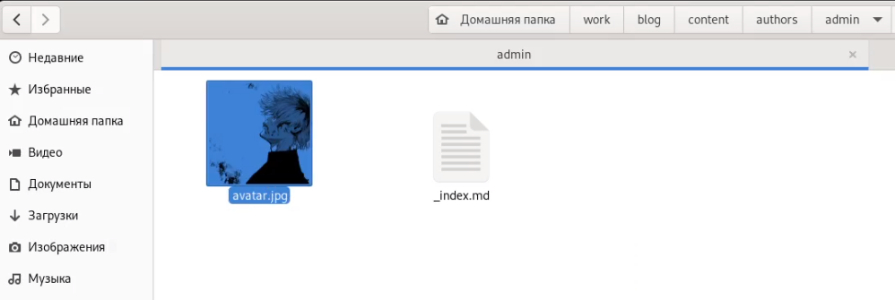
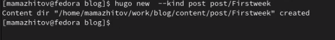
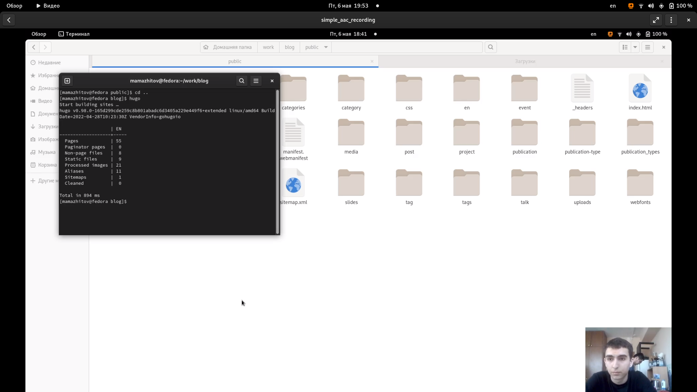

---
## Front matter
title: "2 этап реализации проекта"
subtitle: "Добавить к сайту данные о себе. Разместить посты"
author: "Мажитов Магомед Асхабович"

## Generic otions
lang: ru-RU
toc-title: "Содержание"

## Bibliography
bibliography: bib/cite.bib
csl: pandoc/csl/gost-r-7-0-5-2008-numeric.csl

## Pdf output format
toc: true # Table of contents
toc-depth: 2
lof: true # List of figures
lot: true # List of tables
fontsize: 12pt
linestretch: 1.5
papersize: a4
documentclass: scrreprt
## I18n polyglossia
polyglossia-lang:
  name: russian
  options:
	- spelling=modern
	- babelshorthands=true
polyglossia-otherlangs:
  name: english
## I18n babel
babel-lang: russian
babel-otherlangs: english
## Fonts
mainfont: PT Serif
romanfont: PT Serif
sansfont: PT Sans
monofont: PT Mono
mainfontoptions: Ligatures=TeX
romanfontoptions: Ligatures=TeX
sansfontoptions: Ligatures=TeX,Scale=MatchLowercase
monofontoptions: Scale=MatchLowercase,Scale=0.9
## Biblatex
biblatex: true
biblio-style: "gost-numeric"
biblatexoptions:
  - parentracker=true
  - backend=biber
  - hyperref=auto
  - language=auto
  - autolang=other*
  - citestyle=gost-numeric
## Pandoc-crossref LaTeX customization
figureTitle: "Рис."
tableTitle: "Таблица"
listingTitle: "Листинг"
lofTitle: "Список иллюстраций"
lotTitle: "Список таблиц"
lolTitle: "Листинги"
## Misc options
indent: true
header-includes:
  - \usepackage{indentfirst}
  - \usepackage{float} # keep figures where there are in the text
  - \floatplacement{figure}{H} # keep figures where there are in the text
---

# Цель работы

Добавить на сайт данные о себе. Разместить первые посты.

# Задачи

- Список добавляемых данных.
  - Разместить фотографию владельца сайта.
  - Разместить краткое описание владельца сайта (Biography).
  - Добавить информацию об интересах (Interests).
  - Добавить информацию от образовании (Education).
- Сделать пост по прошедшей неделе.
- Добавить пост на тему по выбору:
  - Управление версиями. Git.
  - Непрерывная интеграция и непрерывное развертывание (CI/CD).

# Выполнение лабораторной работы

**1.** Перешел в каталог /blog/content/authors/admin и открыл файл *index*. Его мы и будем редактировать для того чтобы выполнить первое задание.
(рис. [-@fig:001])

{ #fig:001 width=70% }

**2.** Изменил заглавие, интересы, роль, образование и ссылку на гитхаб.(рис. [-@fig:002])

{ #fig:002 width=70% }

**3.** Разместил краткую информацию о себе.(рис. [-@fig:003])

{ #fig:003 width=70% }

**4.** Нашел фотографию олицетворяющую мое психологическое состояние, скачал ее и переместил в текущую директорию.(рис. [-@fig:004])

{ #fig:004 width=70% }

**5.** Создал новый пост о прошедшей неделе.(рис. [-@fig:005])

{ #fig:005 width=70% }

**6.** Заполинл титульник.(рис. [-@fig:006])

{ #fig:006 width=70% }

**7.** Расписал в посте, как прошла неделя и что я сделал за это время.(рис. [-@fig:007])

{ #fig:007 width=70% }

**8.** Создал новый пост на тему *Git*.(рис. [-@fig:008])

{ #fig:008 width=70% }

**9.** Скопировал все с сайта *Microsoft* и отредактировал текст.(рис. [-@fig:009])

{ #fig:009 width=70% }

**10.** Запустил *hugo*. (рис. [-@fig:010])

{ #fig:010 width=70% }

**11.** Запушил все изменения на Github. (рис. [-@fig:011])

{ #fig:011 width=70% }

# Выводы

Мы добавили информацию о себе и создали первые посты.
