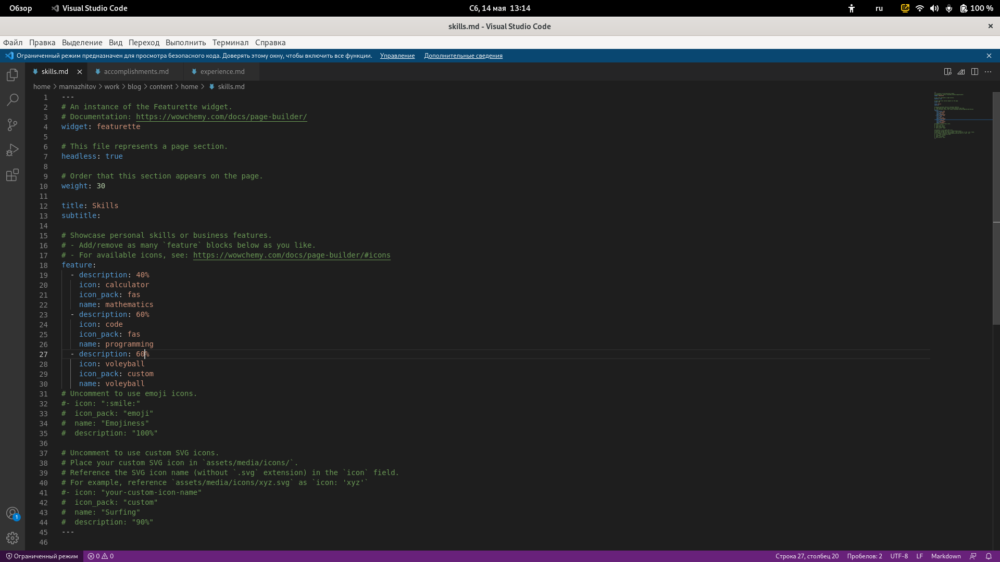
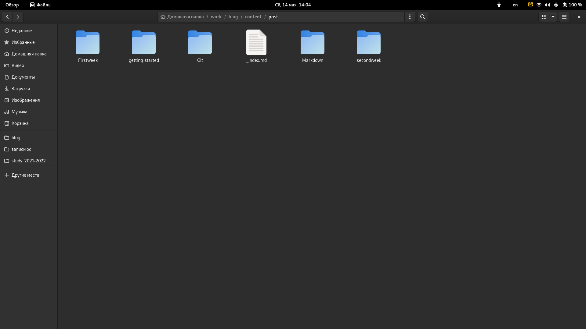
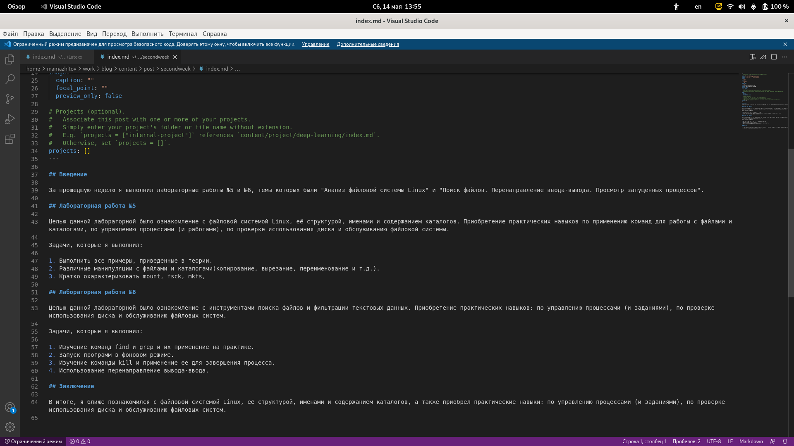
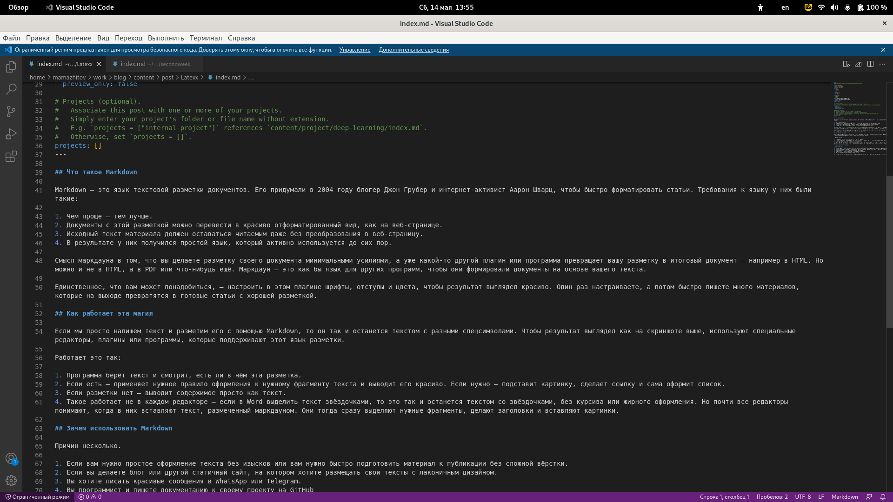

---
## Front matter
lang: ru-RU
title: 3 этап реализации проекта
author: Мажитов М.А.
institute: RUDN University, Moscow, Russian Federation
date:

## Formatting
toc: false
slide_level: 2
theme: metropolis
header-includes: 
 - \metroset{progressbar=frametitle,sectionpage=progressbar,numbering=fraction}
 - '\makeatletter'
 - '\beamer@ignorenonframefalse'
 - '\makeatother'
aspectratio: 43
section-titles: true
---

## Цель работы

Добавить на сайте данные о скилах, достижениях и опыте. Разместить посты

---

## Задачи

- Список достижений.
    - Добавить информацию о навыках (Skills).
    - Добавить информацию об опыте (Experience).
    - Добавить информацию о достижениях (Accomplishments).
- Сделать пост по прошедшей неделе.
- Добавить пост на тему по выбору:
    - Легковесные языки разметки.
    - Языки разметки. LaTeX.
    - Язык разметки Markdown.

---

## Ход работы

Перешел в каталог /blog/content/home/ и открыл файл *skills*. Затем я его отредактировал.
(рис. [-@fig:001])

{ #fig:001 width=70% }

---

## Ход работы

Открыл файл *аccomplishments* и отредактировал его.(рис. [-@fig:002])

{ #fig:002 width=70% }

---

## Ход работы

Затем я отредактировал файл *experience*. (рис. [-@fig:003])

{ #fig:003 width=70% }

---

## Ход работы

Создал новые посты о прошедшей неделе и о Markdown.(рис. [-@fig:004])

{ #fig:004 width=70% }

---

## Ход работы

Заполнил пост о прошедшей неделе.(рис. [-@fig:005])

{ #fig:005 width=70% }

---

## Ход работы

Заполнил пост о markdown.(рис. [-@fig:006])

{ #fig:006 width=70% }

---

## Ход работы

Запустил *hugo*. (рис. [-@fig:010])

{ #fig:010 width=70% }

---

## Ход работы

Запушил все изменения на Github. (рис. [-@fig:011])

{ #fig:011 width=70% }

---

## Вывод

Мы добавили новую информацию о себе и создали посты.