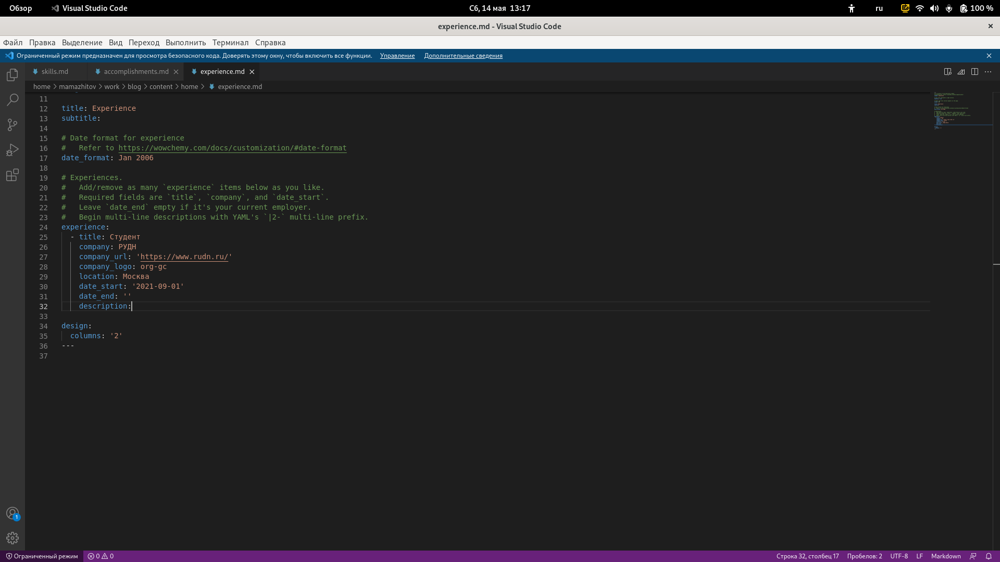
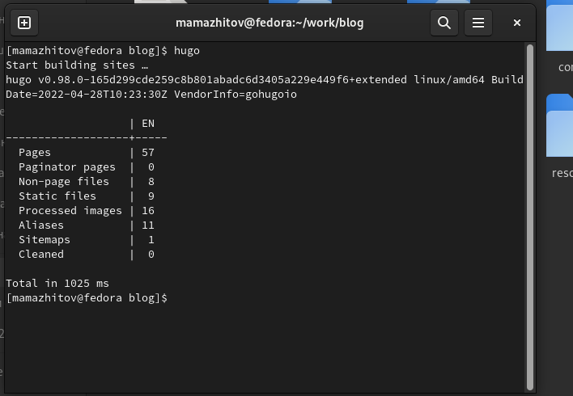

---
## Front matter
title: "3 этап реализации проекта"
subtitle: "Добавить на сайте данные о скилах, достижениях и опыте. Разместить посты"
author: "Мажитов Магомед Асхабович"

## Generic otions
lang: ru-RU
toc-title: "Содержание"

## Bibliography
bibliography: bib/cite.bib
csl: pandoc/csl/gost-r-7-0-5-2008-numeric.csl

## Pdf output format
toc: true # Table of contents
toc-depth: 2
lof: true # List of figures
lot: true # List of tables
fontsize: 12pt
linestretch: 1.5
papersize: a4
documentclass: scrreprt
## I18n polyglossia
polyglossia-lang:
  name: russian
  options:
	- spelling=modern
	- babelshorthands=true
polyglossia-otherlangs:
  name: english
## I18n babel
babel-lang: russian
babel-otherlangs: english
## Fonts
mainfont: PT Serif
romanfont: PT Serif
sansfont: PT Sans
monofont: PT Mono
mainfontoptions: Ligatures=TeX
romanfontoptions: Ligatures=TeX
sansfontoptions: Ligatures=TeX,Scale=MatchLowercase
monofontoptions: Scale=MatchLowercase,Scale=0.9
## Biblatex
biblatex: true
biblio-style: "gost-numeric"
biblatexoptions:
  - parentracker=true
  - backend=biber
  - hyperref=auto
  - language=auto
  - autolang=other*
  - citestyle=gost-numeric
## Pandoc-crossref LaTeX customization
figureTitle: "Рис."
tableTitle: "Таблица"
listingTitle: "Листинг"
lofTitle: "Список иллюстраций"
lotTitle: "Список таблиц"
lolTitle: "Листинги"
## Misc options
indent: true
header-includes:
  - \usepackage{indentfirst}
  - \usepackage{float} # keep figures where there are in the text
  - \floatplacement{figure}{H} # keep figures where there are in the text
---

# Цель работы

Добавить на сайте данные о скилах, достижениях и опыте. Разместить посты

# Задачи

- Список достижений.
    - Добавить информацию о навыках (Skills).
    - Добавить информацию об опыте (Experience).
    - Добавить информацию о достижениях (Accomplishments).
- Сделать пост по прошедшей неделе.
- Добавить пост на тему по выбору:
    - Легковесные языки разметки.
    - Языки разметки. LaTeX.
    - Язык разметки Markdown.

# Выполнение лабораторной работы

**1.** Перешел в каталог /blog/content/home/ и открыл файл *skills*. Затем я его отредактировал.
(рис. [-@fig:001])

{ #fig:001 width=70% }

**2.** Открыл файл *аccomplishments* и отредактировал его.(рис. [-@fig:002])

{ #fig:002 width=70% }

**3.** Затем я отредактирова файл *experience*. (рис. [-@fig:003])

{ #fig:003 width=70% }

**4.** Создал новые посты о прошедшей неделе и о Markdown.(рис. [-@fig:004])

{ #fig:004 width=70% }

**5.** Заполнил пост о прошедшей неделе.(рис. [-@fig:005])

{ #fig:005 width=70% }

**6.** Заполнил пост о markdown.(рис. [-@fig:006])

{ #fig:006 width=70% }

**10.** Запустил *hugo*. (рис. [-@fig:010])

{ #fig:010 width=70% }

**11.** Запушил все изменения на Github. (рис. [-@fig:011])

{ #fig:011 width=70% }

# Выводы

Мы добавили новую информацию о себе и создали посты.
