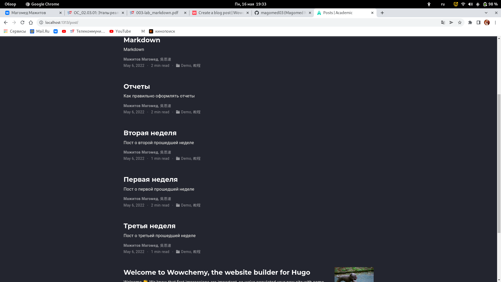

---
## Front matter
lang: ru-RU
title: 4 этап реализации проекта
author: Мажитов М.А.
institute: RUDN University, Moscow, Russian Federation
date:

## Formatting
toc: false
slide_level: 2
theme: metropolis
header-includes: 
 - \metroset{progressbar=frametitle,sectionpage=progressbar,numbering=fraction}
 - '\makeatletter'
 - '\beamer@ignorenonframefalse'
 - '\makeatother'
aspectratio: 43
section-titles: true
---

## Цель работы

Добавить на сайте ссылки на гитхаб и на какую-либо соц.сеть. Разместить посты.

---

## Задачи

Добавить к сайту ссылки на научные и библиометрические ресурсы.

Зарегистрироваться на соответствующих ресурсах и разместить на них ссылки на сайте:

- github : https://github.com/.

Сделать пост по прошедшей неделе.

Добавить пост на тему по выбору:
- Оформление отчёта.

---

## Ход работы

**1.** Перешел в каталог /blog/content/authors/admin и открыл файл *index*. Затем я добавил ссылки на гитхаб и на вк. (рис. [-@fig:001])

{ #fig:001 width=70% }

---

## Ход работы

**2.** Запустил hugo server и посмотрел результат. (рис. [-@fig:002])

{ #fig:002 width=70% }

---

## Ход работы

**3.** Создал необходимые посты.(рис. [-@fig:003])

{ #fig:003 width=70% }

---

## Ход работы

**4.** Заполнил пост о прошедшей неделе.(рис. [-@fig:004])

{ #fig:004 width=70% }

---

## Ход работы

**5.** Заполнил пост об оформлении отчетов.(рис. [-@fig:005])

{ #fig:005 width=70% }

---

## Ход работы

**6.** Проверил добавились ли посты на сайте. (рис. [-@fig:006])

{ #fig:006 width=70% }

---

## Выводы

Мы добавили ссылки и создали посты.
